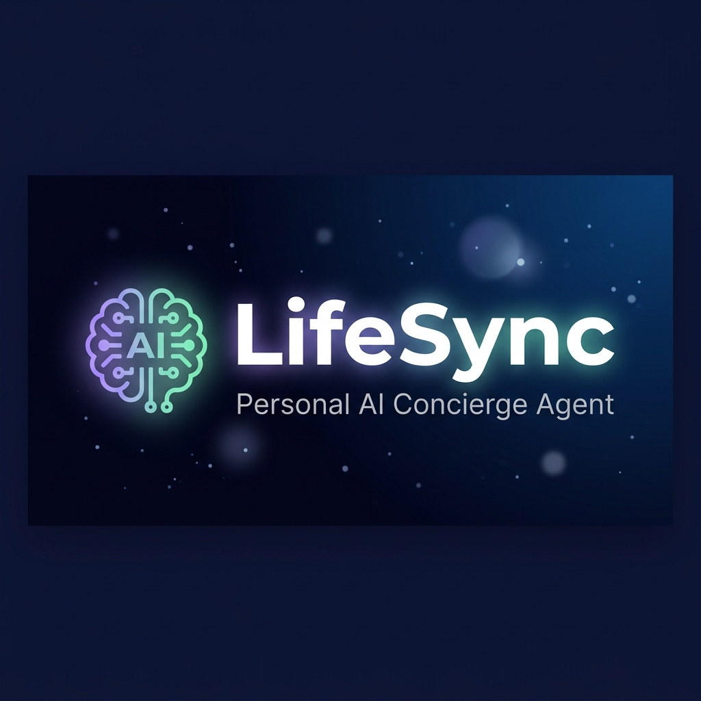

<p align="center">
  
</p>

<h1 align="center">LifeSync — Personal AI Concierge Agent</h1>

<p align="center">
  <em>Your everyday AI assistant that checks the time, crunches numbers, tracks weather, and keeps your notes — all through natural conversation.</em>
</p>

<p align="center">
  
  
  
  
  
</p>

<p align="center">
  <a href="#-demo">Demo</a> •
  <a href="#-problem-statement">Problem</a> •
  <a href="#-solution">Solution</a> •
  <a href="#-architecture">Architecture</a> •
  <a href="#-key-concepts-demonstrated">Key Concepts</a> •
  <a href="#-setup">Setup</a> •
  <a href="#-deployment">Deployment</a>
</p>

---

## 🎬 Demo

> **Live Demo:** [Deployed URL on Railway]  
> **Video Demo:** [YouTube Video Link]

**Try these prompts:**
- *"What time is it in Tokyo?"*
- *"Calculate a 20% tip on $125.75"*
- *"What's the weather in Paris?"*
- *"Save a note: Buy birthday gift for Mom"*
- *"Show me all my notes"*

---

## 🔍 Problem Statement

We interact with **multiple apps** every day for simple micro-tasks — checking time zones, doing quick math, looking up weather, jotting down reminders. Each context switch adds friction and wastes time.

**What if one AI assistant could handle all of that through a single, natural conversation?**

---

## 💡 Solution

**LifeSync** is a personal AI concierge agent that consolidates everyday micro-tasks into a single, beautiful chat interface. Built with **Google's Agent Development Kit (ADK)** and powered by **Gemini 2.5 Flash**, it understands natural language and intelligently decides which tools to use based on your request.

### ✨ Key Features

| Feature | Description |
|---------|-------------|
| 🕐 **Time & Date** | Get the current time in any timezone worldwide |
| 🧮 **Smart Calculator** | Natural language math — *"What's 15% of 230?"* |
| 🌤️ **Weather Check** | Check weather conditions for any city |
| 📝 **Note Taking** | Save and retrieve notes through conversation |
| 🧠 **Context Memory** | Remembers your conversation within a session |
| 🎨 **Premium UI** | Stunning dark-mode glassmorphism chat interface |

---

## 🏗️ Architecture

```
┌─────────────────────────────────────────────────┐
│                   Browser                        │
│  ┌─────────────────────────────────────────┐    │
│  │   Glassmorphism Chat UI                  │    │
│  │   (HTML5 + CSS3 + Vanilla JS)           │    │
│  └───────────────┬─────────────────────────┘    │
│                  │ POST /chat (JSON)             │
└──────────────────┼──────────────────────────────┘
                   ▼
┌──────────────────────────────────────────────────┐
│              Flask Server (app.py)                │
│                                                   │
│  ┌────────────────────────────────────────────┐  │
│  │  🔒 Security Layer                         │  │
│  │  • Input validation (2000 char limit)      │  │
│  │  • API keys via environment variables      │  │
│  │  • No secrets in code                      │  │
│  └──────────────┬─────────────────────────────┘  │
│                 ▼                                  │
│  ┌────────────────────────────────────────────┐  │
│  │  🤖 Google ADK InMemoryRunner              │  │
│  │  • Session management per client           │  │
│  │  • Conversation memory                     │  │
│  └──────────────┬─────────────────────────────┘  │
│                 ▼                                  │
│  ┌────────────────────────────────────────────┐  │
│  │  🧠 LifeSync Agent (agent.py)              │  │
│  │  Model: gemini-2.5-flash                   │  │
│  │                                            │  │
│  │  Tools:                                    │  │
│  │  ├── get_current_datetime(timezone_offset) │  │
│  │  ├── calculate(expression)                 │  │
│  │  ├── get_weather(city)                     │  │
│  │  ├── take_note(note)                       │  │
│  │  └── get_notes()                           │  │
│  └────────────────────────────────────────────┘  │
└──────────────────────────────────────────────────┘
```

### How It Works

1. **User sends a message** through the chat UI
2. **Flask receives** the request at `POST /chat` and validates input
3. **ADK Runner** routes the message to the LifeSync agent with session context
4. **Gemini 2.5 Flash** analyzes the request and decides which tool(s) to call
5. **Tools execute** and return structured data to the LLM
6. **Agent formats** a natural language response
7. **Response streams** back to the browser and renders in the chat

---

## 📋 Key Concepts Demonstrated

This project demonstrates **3 key concepts** from the Kaggle 5-Day AI Agents Course:

| # | Key Concept | Where | Details |
|---|-------------|-------|---------|
| 1 | **Agent System (ADK)** | `agent.py` | Full Google ADK agent with 5 function-calling tools, system instructions, and Gemini 2.5 Flash model |
| 2 | **Deployability** | `Dockerfile`, `Procfile`, `railway.json` | Production-ready containerized deployment on Railway with Gunicorn WSGI |
| 3 | **Security Features** | `app.py`, `.env` | API keys via env vars, input length validation, safe math eval with allowlisted functions, `.gitignore` for secrets |

---

## 🔒 Security Implementation

| Security Measure | Implementation |
|-------------------|---------------|
| **No hardcoded secrets** | API key loaded from `GOOGLE_API_KEY` env var via `python-dotenv` |
| **Input sanitization** | Message length capped at 2000 characters |
| **Safe code execution** | Calculator uses `eval()` with empty `__builtins__` and allowlisted math functions only |
| **Git protection** | `.env` excluded via `.gitignore` — never committed to repo |
| **Error handling** | All agent errors caught and returned as safe JSON responses |

---

## 🛠️ Setup

### Prerequisites

- **Python 3.10+**
- **Google Gemini API Key** — Get one free at [aistudio.google.com](https://aistudio.google.com)

### Quick Start

```bash
# 1. Clone the repository
git clone https://github.com/Hariswar8018/Ai-Agent.git
cd Ai-Agent

# 2. Install dependencies
pip install -r requirements.txt

# 3. Configure your API key
cp .env.example .env
# Edit .env and paste your GOOGLE_API_KEY

# 4. Run the app
python3 app.py
```

Open **http://localhost:5000** in your browser and start chatting! 🚀

---

## 🚀 Deployment

### Deploy to Railway (Recommended)

1. **Push your code** to GitHub
2. Go to [railway.app](https://railway.app) → **New Project** → **Deploy from GitHub**
3. Select your repository
4. Add environment variable:
   ```
   GOOGLE_API_KEY = your_gemini_api_key_here
   ```
5. Railway auto-detects the `Dockerfile` and deploys
6. Your app is live at the Railway-provided URL! ✨

### Docker (Manual)

```bash
docker build -t lifesync .
docker run -p 8080:8080 -e GOOGLE_API_KEY=your_key lifesync
```

---

## 📁 Project Structure

```
Ai-Agent/
├── app.py                 # Flask server + ADK agent integration
├── agent.py               # Google ADK Agent definition + 5 tools
├── requirements.txt       # Python dependencies
├── Procfile               # Railway process file
├── Dockerfile             # Container deployment
├── railway.json           # Railway configuration
├── .env.example           # Example environment variables
├── .gitignore             # Git ignore rules (protects .env)
├── README.md              # This file
├── static/
│   ├── banner.png         # Project banner image
│   ├── style.css          # Dark-mode glassmorphism CSS
│   └── script.js          # Chat frontend logic
└── templates/
    └── index.html         # Main chat page
```

---

## 🎨 Tech Stack

| Layer | Technology |
|-------|-----------|
| **AI Agent** | Google ADK 2.3, Gemini 2.5 Flash |
| **Backend** | Python 3.11, Flask 3.1 |
| **Frontend** | HTML5, CSS3 (glassmorphism), Vanilla JavaScript |
| **Deployment** | Docker, Gunicorn, Railway |
| **Design** | Inter font, gradient accents, micro-animations |

---

## 🎯 Track

**Concierge Agents** — LifeSync is a personal AI concierge that streamlines everyday micro-tasks through a single conversational interface, freeing time for what really matters.

---

## 👨‍💻 Author

Built for the **Kaggle AI Agents: Intensive Vibe Coding Capstone Project 2026**

---

<p align="center">
  <sub>Made with ❤️ using Google ADK + Gemini</sub>
</p>
